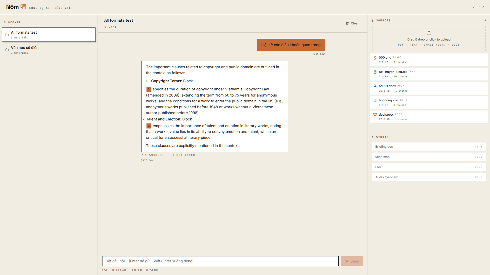
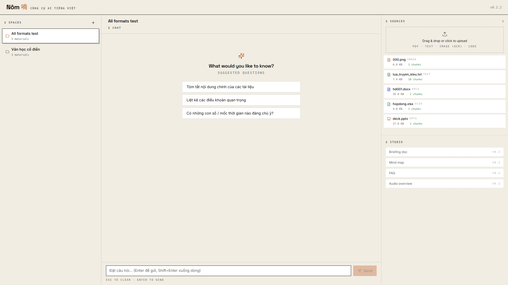
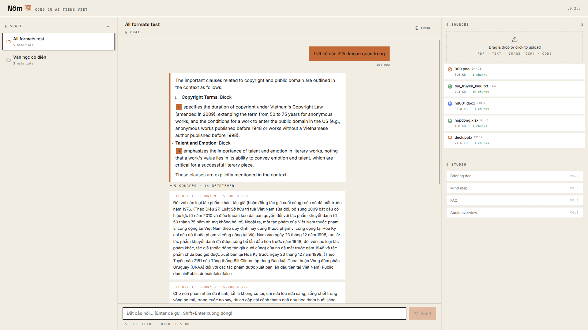
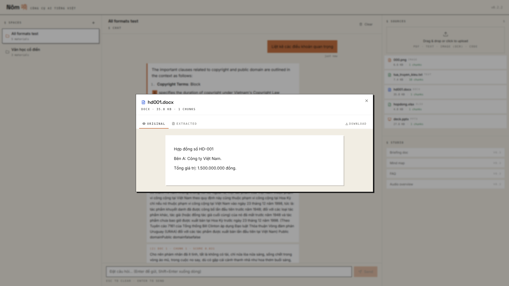
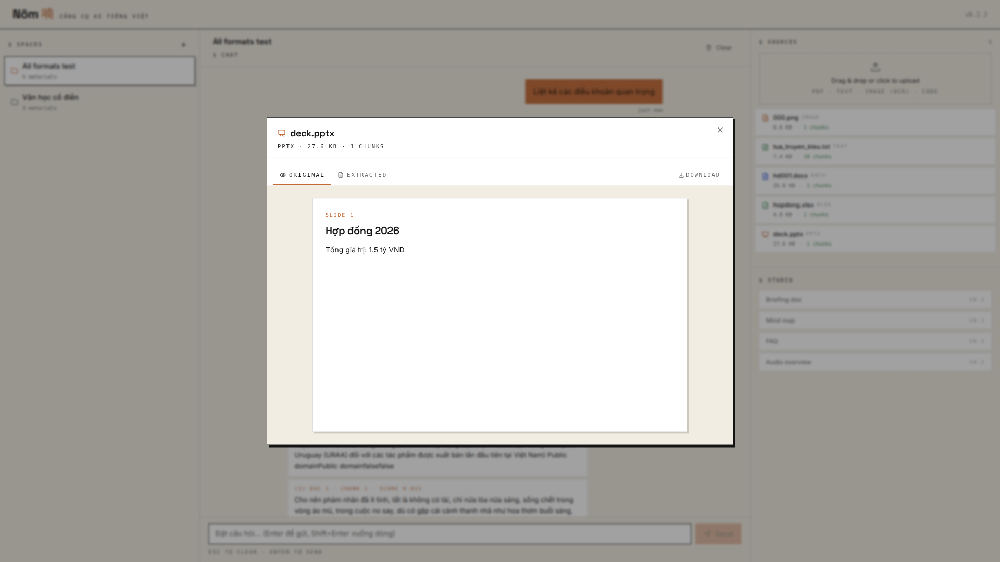
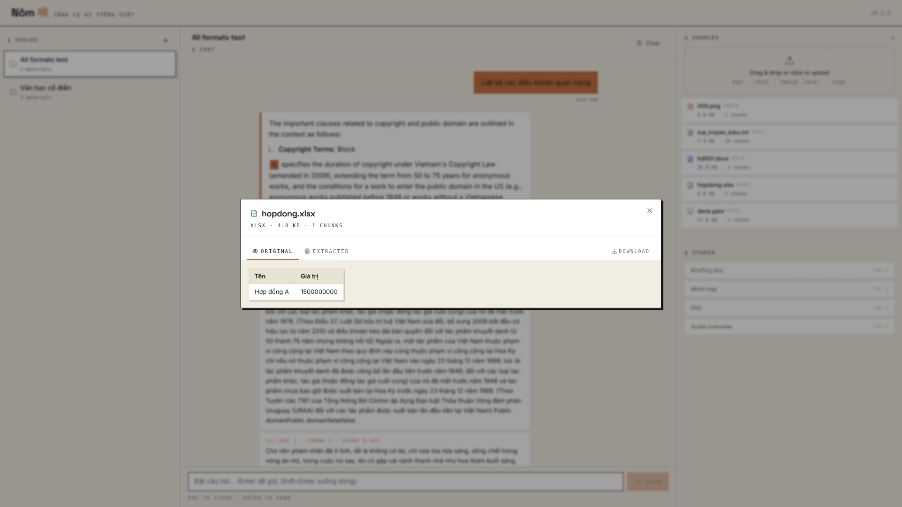

# Nôm 喃

**Open-source Python toolkit for building Vietnamese AI applications.**

> Named after *chữ Nôm* — the script Vietnam wrote in for a millennium.

[](LICENSE)
[](CHANGELOG.md)
[](https://www.python.org)

A local-first toolkit. **No data leaves your machine.** Use any LLM (Ollama by default), any embedder, any document type — Nôm wires them into a Vietnamese-aware RAG pipeline you can ship as either a Python library or a deployable chat web app.

---

## The 3-line demo

```bash
pip install "nom-vn[chat]"     # FastAPI + React UI + parsers + embeddings
nom serve                       # opens http://localhost:8080
# upload PDFs/Word/Excel/PowerPoint/images, ask questions in Vietnamese
```



The web app is built into the wheel — there's nothing else to install.

---

## What ships today

| Module | What it does | Status |
|---|---|---|
| `nom.text` | Vietnamese text utilities — NFC, diacritic restoration, word/sentence tokenization | ✅ |
| `nom.chunking` | VN-aware document chunking | ✅ |
| `nom.embeddings` | `Embedder` Protocol + `VietnameseEmbedder` (BGE-base ft) + `AITeamVNEmbedder` (BGE-M3 ft) | ✅ |
| `nom.retrieve` | `BM25Retriever`, `DenseRetriever`, hybrid RRF fusion | ✅ |
| `nom.doc` | Document pipeline: PDF / DOCX / XLSX / PPTX / HTML / JSON / image (OCR) → text | ✅ |
| `nom.llm` | `LLM` Protocol + `Ollama` adapter (any model: Qwen3, Sailor2, Phi-4, …) | ✅ |
| `nom.rag` | One-line RAG composition (`RAG.from_documents(...)`) | ✅ |
| `nom.chat` | FastAPI server + React/ShadCN UI, `MemoryStore` + `SqliteStore` + pluggable `EmbeddingsCache` | ✅ |

---

## NotebookLM-style document Q&A web app

Three-pane editorial layout: spaces sidebar / chat thread / sources + studio. Dark editorial palette, sharp corners, citation traceability.

Three-pane editorial layout (1920×1080 desktop):



Citations are first-class. Every chunk number is a chip you can click to see the source passage:



---

## Browser viewers for every supported format

Click any material in the right panel — **Original** tab renders the file natively, **Extracted** tab shows what the chunker + embedder saw. PDFs / images use the browser's native viewer; Office formats render as structured HTML so the browser can show them without LibreOffice.

| DOCX → editorial paragraphs | PPTX → 16:10 slide cards | XLSX → HTML tables with sheet picker |
|---|---|---|
|  |  |  |

---

## Library use (no web app)

```python
from nom.rag import RAG
from nom.llm import Ollama

rag = RAG.from_documents(
    ["contract.pdf", "letter.docx", "Hợp đồng số HD-001..."],
    llm=Ollama(model="qwen3:8b"),
)

answer = rag.ask("Có bao nhiêu hợp đồng có phạt vi phạm?")
print(answer.text)         # the LLM's response
print(answer.citations)    # [(doc_idx, chunk_idx, score, text), ...]
```

Document extraction without RAG:

```python
from nom.doc import extract
from nom.llm import Ollama

result = extract(
    "hop_dong.pdf",
    schema={"so_hop_dong": str, "ngay_ky": "date", "tong_gia_tri": "amount_vnd"},
    llm=Ollama(model="qwen3:8b"),
)
```

Text utilities without the rest:

```python
from nom.text import normalize, fix_diacritics, word_tokenize

clean = normalize("Hợp đồng số 02/HĐ/2025")
fixed = fix_diacritics("Hop dong nay duoc lap")  # → "Hợp đồng này được lập"
toks  = word_tokenize("Thành phố Hồ Chí Minh")    # ["Thành phố", "Hồ Chí Minh"]
```

---

## Install

```bash
pip install nom-vn                            # text + chunking + retrieve + rag (no I/O deps)
pip install "nom-vn[doc]"                     # + PDF / Office / OCR parsers
pip install "nom-vn[embeddings]"              # + sentence-transformers
pip install "nom-vn[llm]"                     # + httpx for Ollama / OpenAI-compat
pip install "nom-vn[chat]"                    # + FastAPI / uvicorn + everything above
pip install "nom-vn[all]"                     # the lot
```

OCR (image / scanned PDF) needs Tesseract installed system-wide:

```bash
# Debian/Ubuntu
sudo apt install tesseract-ocr tesseract-ocr-vie
# Conda
conda install -c conda-forge tesseract
# macOS
brew install tesseract tesseract-lang
```

`nom serve` auto-detects the Tesseract binary + finds `vie.traineddata`; if absent, image uploads index as zero chunks rather than failing.

---

## Architecture in one line

7 layers (Primitives / Models / Retrieval / RAG / Storage / Application / Deployment), every meaningful boundary is a `typing.Protocol`. Local single-process today; the cloud path replaces three Protocol implementations and changes nothing in the application layer.

See **[docs/architecture.md](docs/architecture.md)** for the full layered model, Protocol seam table, and scaling-path reference.

---

## Documentation

- **[docs/architecture.md](docs/architecture.md)** — the 7-layer model, Protocol seams, scaling path, anti-architecture rules
- **[docs/pipeline.md](docs/pipeline.md)** — the document-extraction pipeline end-to-end with per-stage picks
- **[docs/benchmark.md](docs/benchmark.md)** — measured numbers per module
- **[docs/sota_vn_2026q2.md](docs/sota_vn_2026q2.md)** — SOTA local LLM / embedding / OCR for Vietnamese (April 2026 snapshot, every claim cited)
- **[docs/oss_landscape_2026q2.md](docs/oss_landscape_2026q2.md)** — OSS local-AI / RAG landscape: patterns to steal, traps to avoid
- **[benchmarks/](benchmarks/)** — reproducible measurement scripts (perf + retrieval + accuracy)
- **[CONTRIBUTING.md](CONTRIBUTING.md)** — dev setup, PR rules
- **[CHANGELOG.md](CHANGELOG.md)** — version history

---

## License

Apache 2.0. Fine-tune, redistribute, commercialize freely. Please keep attribution.

## Citation

```bibtex
@software{nom2026,
  title  = {Nôm: an open Python toolkit for Vietnamese AI applications},
  author = {Nguyen, Viet Anh and {Neural Research Lab}},
  year   = {2026},
  url    = {https://nrl.ai/nom},
  note   = {Apache 2.0}
}
```

## Built by

[Neural Research Lab](https://nrl.ai) — open-source AI tooling. Edge inference, private assistants, training, labeling.
