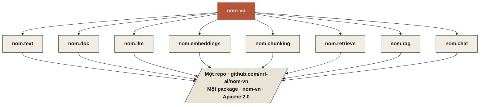
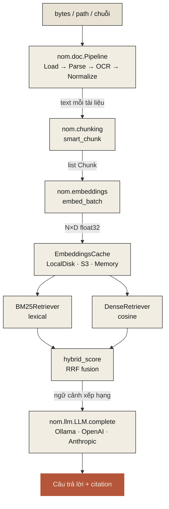
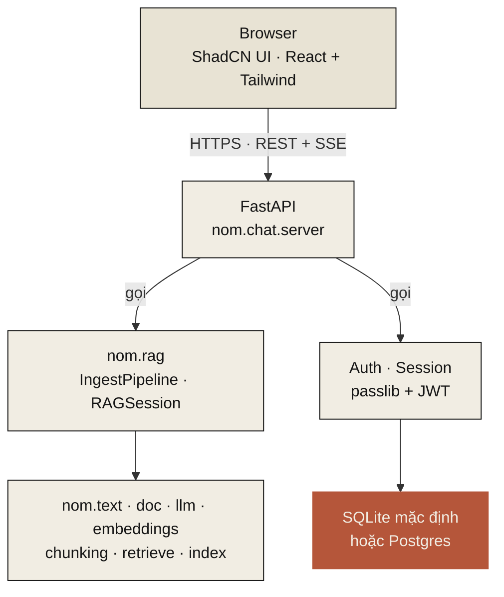

# Nôm — Kiến trúc

Một **thư viện duy nhất** với ranh giới giữa các submodule rõ ràng.
Một repo, một package PyPI (`nom-vn`), một license Apache 2.0.
Submodule được cài qua extras để người dùng không phải trả cho thứ
mình không dùng.

Kiến trúc đi theo hai nguyên tắc bất di bất dịch trong sổ tay vận hành nội bộ:

- **Nguyên tắc 11 — Kiểm tra dependency trước khi áp dụng.** Dep dạng pickle hay binary mờ bị tự động từ chối. Ưu tiên tự cài đặt lại trong cây mã nguồn khi khả thi. Ghi rõ license, định dạng và kết quả kiểm tra của mỗi dep trong `BENCHMARK.md`.
- **Nguyên tắc 12 — Chỉ dùng benchmark đã kiểm chứng.** Mọi số liệu trong tài liệu hướng tới người dùng đều phải truy được về một script chạy được (có warmup + best-of-N cho throughput) hoặc một nguồn công khai có trích dẫn.

---

## TL;DR — một thư viện, submodule phân tầng



(Mỗi module mục đích đầy đủ ở bảng phía dưới.)

| Submodule | Mục đích | Trạng thái | Hard deps | Extras |
|---|---|---|---|---|
| `nom.text` | Tiện ích text tiếng Việt | đã phát hành v0.0.2 | không | — |
| `nom.doc` | Pipeline PDF/ảnh → dict typed | đã phát hành v0.0.3 | `pydantic` | `[doc]` thêm pdf/ocr |
| `nom.llm` | Adapter LLM | đã phát hành v0.0.3 | `pydantic` | `[llm]` thêm httpx |
| `nom.embeddings` | Adapter embedding tiếng Việt | dự kiến v0.0.4 | `pydantic` | `[embeddings]` thêm model loader |
| `nom.chunking` | Chunking tài liệu nhận biết VN | dự kiến v0.0.4 | `pydantic` | — |
| `nom.retrieve` | BM25 + dense + hybrid scoring | dự kiến v0.0.5 | `pydantic` | — (numpy đi kèm bắc cầu cùng embeddings) |
| `nom.index` | Adapter vector store (Chroma, Qdrant, pgvector) | dự kiến v0.1 | `pydantic` | `[index-chroma]`, `[index-qdrant]`, `[index-pg]` |
| `nom.rag` | Composition RAG cấp cao | dự kiến v0.1 | `pydantic` | reuse extras khác |
| `nom.chat` | App FastAPI + UI HTMX optional | dự kiến v0.2 | `pydantic` | `[chat]` thêm fastapi, jinja2 |

**Một lệnh cài lớn dần khi dùng**:

```bash
pip install nom-vn                            # chỉ text + doc.schemas (không PDF/OCR/LLM)
pip install "nom-vn[doc]"                     # + xử lý PDF, OCR, ảnh
pip install "nom-vn[llm]"                     # + adapter LLM (httpx)
pip install "nom-vn[embeddings,index-chroma]" # + building block RAG với Chroma
pip install "nom-vn[all]"                     # tất cả
pip install "nom-vn[chat]"                    # chat app deploy được
```

---

## Vì sao một thư viện (chứ không phải ba)

Cân nhắc các phương án thay thế và loại từng cái:

1. **Ba repo riêng** (thư viện lõi / RAG glue / chat app) — chia thương hiệu, nhân CI overhead, refactor xuyên suốt đau đớn, làm người dùng nhầm package nào nên cài.
2. **Mega-monolith không có extras** — mọi người dùng kéo mọi dep kể cả cái họ không bao giờ dùng; install phình to; bề mặt audit nổ.

**Một repo với extras** khớp với hạt thực sự: *thương hiệu* (Nôm) là một thứ; *bề mặt triển khai* khác nhau giữa các submodule. Extras để `pip` thể hiện điều đó.

Cách này cũng đơn giản hoá:
- **Versioning** — một CHANGELOG, một tag, một release
- **Refactor xuyên suốt** — đổi một Stage Protocol trong `nom.doc`, update call site trong `nom.rag` cùng PR
- **Khả năng phát hiện** — một trang Github org, một trang PyPI, một trang doc
- **Toàn vẹn thương hiệu** — mọi phần đều nói "Nôm"

---

## Đường nối Protocol & đường mở rộng quy mô

Mọi ranh giới có ý nghĩa trong `nom-vn` đều là `typing.Protocol` (chỗ
hợp lý thì `runtime_checkable`). Đường nhanh là single-process Python;
đường cloud chỉ cần thay ba bản hiện thực Protocol và không đổi gì ở
tầng ứng dụng. Trạng thái sống ở lớp lưu trữ; tính toán không có
trạng thái. Cache có chọn lọc — chỉ cache thứ đắt phải tính lại
(embedding), không cache thứ rẻ (BM25, parsing).

### Bảy lớp

| Lớp | Vai trò | Stateful? | Module hôm nay |
|---|---|---|---|
| **0 · Primitive** | Tiện ích text VN, chunking | Không | `nom.text`, `nom.chunking` |
| **1 · Model** | Embedder, LLM, OCR backend | Có (lazy-load weights) | `nom.embeddings`, `nom.llm`, `nom.doc.OCR` |
| **2 · Retrieval** | BM25, Dense, hybrid fusion | Có (trong RAM index per-corpus) | `nom.retrieve` |
| **3 · RAG** | Compose model + retrieval thành ask() | Immutable per-corpus | `nom.rag.RAG` |
| **4 · Storage** | Ranh giới persistence | Có (state persistent duy nhất) | `nom.chat.Store`, `nom.chat.EmbeddingsCache` |
| **5 · Application** | HTTP + UI bundle, factory DI | Không (delegate cho Lớp 4) | `nom.chat.server.build_app` |
| **6 · Deployment** | CLI, config, packaging | Không | `nom.chat.cli`, `pyproject.toml`, `ui/` |

### Đường nối Protocol nằm đâu trong code

| Đường nối | Định nghĩa ở | Impl mặc định | Impl tương lai (cụ thể, không giả định) |
|---|---|---|---|
| `nom.embeddings.Embedder` | `src/nom/embeddings/base.py` | `VietnameseEmbedder` (BGE-base, 768d) | `AITeamVNEmbedder` (BGE-M3 ft, +27.9% Acc@1 trên Zalo Legal — xem `docs/sota_vn_2026q2.md`) |
| `nom.llm.LLM` | `src/nom/llm/base.py` | `Ollama` | `OpenAI`, `Anthropic`, `LlamaCppPython` |
| `nom.retrieve.Retriever` | `src/nom/retrieve/base.py` | `BM25Retriever`, `DenseRetriever` (numpy trong RAM) | `FaissRetriever` / `QdrantRetriever` ở >100k chunk (dự kiến `nom.index`) |
| `nom.doc.Stage` | `src/nom/doc/stages.py` | `Tesseract` cho OCR | `DotsMocrOCR`, `PaddleOcrV5`, `Qwen3VLOCR` (gate qua benchmark corpus VN theo nguyên tắc 12) |
| `nom.chat.Store` | `src/nom/chat/store.py` | `MemoryStore`, `SqliteStore` | `PostgresStore` (~250 LOC `psycopg`, không ORM) |
| `nom.chat.EmbeddingsCache` | `src/nom/chat/embeddings_cache.py` | `LocalDiskCache` (một `.npy` per material), `MemoryCache` | `S3Cache`, `GcsCache`, `RedisCache` |

### Luồng dữ liệu (ingest RAG → query → answer)



### Đường mở rộng quy mô (cụ thể, không có số tưởng tượng)

| Quy mô | Topology | Store | EmbeddingsCache | Retriever | Thay đổi net |
|---|---|---|---|---|---|
| 1 user, laptop | 1 proc | `SqliteStore` | `LocalDiskCache` | BM25 + Dense | (mặc định hôm nay) |
| 1 người dùng, 100K+ chunk | 1 proc | `SqliteStore` | `LocalDiskCache` | đổi → `FaissRetriever` | đổi đúng một constructor |
| Team nhỏ, 1 host | uvicorn worker | `SqliteStore` (WAL) | `LocalDiskCache` (volume chia sẻ) | như trên | thêm nginx phía trước |
| Multi-host / cloud | N pod app stateless | `PostgresStore` | `S3Cache` | `QdrantRetriever` | ba impl Protocol, **không đổi app** |
| SaaS multi-tenant | N pod + auth | như trên + tenant scoping | như trên + tenant prefix | như trên | thêm middleware auth trong `nom.chat.server` |

Số throughput / latency per-tier cố ý bỏ — cần benchmark, không phải
phỏng đoán (rule verified-benchmarks). `benchmarks/perf/`
(component-level) và `benchmarks/rag/` (retrieval end-to-end) là chỗ
để đo cho khối lượng công việc của bạn.

### Anti-architecture rule

Cái chúng tôi cố ý **không** xây, và lý do:

1. **Không service locator / framework DI.** Pass dep qua constructor. 8+ param là dấu hiệu class làm quá nhiều.
2. **Không class `…Manager`.** Nếu tên không mô tả nó sở hữu cái gì, class đó có lẽ không nên tồn tại.
3. **Không abstract base class cho chia sẻ hành vi.** Protocol cho contract; helper module-level cho code chia sẻ.
4. **Không event-emitter / pub-sub.** Call stack Python là log sự kiện của bạn.
5. **Không lớp generic Repository / Entity / DTO "future-proof".** Gọi đúng tên cái đang là.
6. **Không ORM.** SQL là ngôn ngữ; chúng tôi biết. `sqlite3` / `psycopg` trực tiếp giữ query plan dễ thấy. (Đã cân nhắc SQLAlchemy / SQLModel; loại — thêm ~15 MB phụ thuộc chỉ để hỗ trợ một bước đổi backend mà đã là Protocol 7-method.)
7. **Không micro-service cho đến khi có ≥3 team triển khai độc lập.** Chúng tôi có một repo và một dev.
8. **Không config framework.** `argparse` + env var + một dataclass `Config` là đủ.

### Cái chúng tôi cố ý không abstract

- **Tokenization** (`nom.text.word_tokenize`) — quá nền tảng; thay đổi sẽ làm mọi benchmark phải đo lại. Giữ là function call.
- **Thuật toán fusion** (RRF của `hybrid_score`) — quá nhỏ để xứng đáng Protocol; chỉ là function với arg `method`.
- **Chiến lược chunking** — `smart_chunk` là function, không phải service. Có thể lớn lên thành Protocol `Chunker` khi có chiến lược thứ hai đáng đổi.
- **Framework HTTP** (FastAPI) — thay nó tốn công hơn giá trị. Chấp nhận sự ràng buộc.

---

## Spec từng module

### `nom.text` — Tiện ích text tiếng Việt (đã phát hành, v0.0.2)

Normalize, tokenization, sentence splitting pure-stdlib. Zero hard dep.

```python
from nom.text import normalize, fix_diacritics, word_tokenize, sent_tokenize, text_normalize

normalize("Hợp đồng số 02")              # composition NFC
fix_diacritics("Hop dong nay duoc lap")  # khôi phục rule-based (~41% baseline)
word_tokenize("Hợp đồng số 02")          # ["Hợp đồng", "số", "02"]
sent_tokenize("Hôm nay. Anh có cần?")    # ["Hôm nay.", "Anh có cần?"]
text_normalize("Hợp đồng  ngày 14, tháng 3.")  # dọn whitespace + dấu câu
```

### `nom.doc` — Pipeline trích xuất tài liệu (đã phát hành, v0.0.3)

Pipeline 6 stage: Load → Parse → OCR → Normalize → Extract → Validate. Mọi stage đều thật.

```python
from nom.doc import extract
from nom.llm import Ollama

result = extract(
    "hop_dong.pdf",
    schema={"so_hop_dong": str, "ngay_ky": "date", "tong_gia_tri": "amount_vnd"},
    llm=Ollama(model="qwen3:8b"),
)
```

Xem `docs/pipeline.md` cho chi tiết per-stage đầy đủ.

### `nom.llm` — Adapter LLM (đã phát hành, v0.0.3)

```python
from nom.llm import Ollama, OpenAI, Anthropic   # hôm nay chỉ Ollama là thật

llm = Ollama(model="qwen3:8b")
llm.complete("Tóm tắt văn bản:", schema=optional_json_schema)
```

`LLM` là `Protocol` — bất kỳ class nào có `complete(prompt, schema, max_tokens) -> str` đều đủ tiêu chuẩn. Người dùng cắm backend tuỳ biến mà không cần kế thừa từ chúng tôi.

### `nom.embeddings` — Adapter embedding tiếng Việt (dự kiến v0.0.4)

```python
from nom.embeddings import VietnameseEmbedder, Embedder

embedder: Embedder = VietnameseEmbedder()           # mô hình mặc định
vec = embedder.embed("Hợp đồng số 02")               # → np.ndarray
vecs = embedder.embed_batch([...])                   # → np.ndarray (N, D)
```

**Mô hình mặc định**: `AITeamVN/Vietnamese_Embedding` (fine-tune BGE-M3 trên ~300k triplet VN, top performer trên [VN-MTEB](https://arxiv.org/html/2507.21500v1)). Weights Apache 2.0, format `safetensors` (tất định, không pickle).

`Embedder` là `Protocol`:

```python
class Embedder(Protocol):
    name: str
    dim: int
    def embed(self, text: str) -> NDArray: ...
    def embed_batch(self, texts: list[str]) -> NDArray: ...
```

### `nom.chunking` — Chunking tài liệu nhận biết VN (dự kiến v0.0.4)

```python
from nom.chunking import smart_chunk

chunks = smart_chunk(
    text,
    max_tokens=512,
    overlap=64,
    boundary="sentence",      # "paragraph" | "sentence" | "char"
)
# → list[Chunk(text, start, end, n_tokens, metadata)]
```

Pure Python. Dùng `nom.text.sent_tokenize` cho boundary VN-aware. Đếm token qua `nom.text.word_tokenize` (compound đếm là 1).

### `nom.retrieve` — Primitive retrieval in-process (dự kiến v0.0.5)

```python
from nom.retrieve import BM25Retriever, DenseRetriever, hybrid_score

bm25 = BM25Retriever.fit(corpus_chunks)
dense = DenseRetriever(embedder, embeddings)

bm25_hits = bm25.search(query, top_k=20)
dense_hits = dense.search(embedder.embed(query), top_k=20)
fused = hybrid_score(bm25_hits, dense_hits, alpha=0.5, method="rrf")
```

Trong tiến trình bằng numpy; không DB. Cho tới ~100k chunk là đủ — phần lớn người dùng không bao giờ cần chuyển lên backend nặng hơn.

### `nom.index` — Adapter vector store (dự kiến v0.1)

```python
from nom.index import ChromaIndex, QdrantIndex, PgVectorIndex, Index

index: Index = ChromaIndex(path="./vectors")
index.upsert(chunks_with_embeddings)
hits = index.query(query_vector, top_k=10)
```

`Index` là `Protocol`. Mỗi backend opt-in qua extras: `pip install "nom-vn[index-chroma]"`. User có vector store của riêng họ implement Protocol và skip extras hoàn toàn.

### `nom.rag` — Composition RAG cấp cao (dự kiến v0.1)

```python
from nom.rag import IngestPipeline, RAGSession
from nom.index import ChromaIndex
from nom.embeddings import VietnameseEmbedder
from nom.llm import Ollama

# 1. Setup
index = ChromaIndex(path="./vectors")
embedder = VietnameseEmbedder()
llm = Ollama(model="qwen3:8b")

# 2. Ingest
ingest = IngestPipeline(index=index, embedder=embedder, chunk_size=512)
ingest.add_files(["contracts/*.pdf"])

# 3. Hỏi
session = RAGSession(index=index, embedder=embedder, llm=llm)
answer = session.ask("Có bao nhiêu hợp đồng có điều khoản phạt vi phạm trên 10%?")
print(answer.text)         # câu trả lời của LLM
print(answer.citations)    # [(doc_id, page, chunk_idx), ...]
```

Ghép các submodule cấp thấp; không thêm khái niệm bên ngoài mới. Người dùng muốn chunker khác hay reranker khác thì đổi qua Protocol.

### `nom.chat` — Chat app deploy được (dự kiến v0.2)

Sản phẩm headline cuối cùng: web app tự đứng cho Q&A tài liệu tiếng
Việt. Ship **bên trong package Python** để người dùng có trải nghiệm đầy đủ
với ``pip install`` + một lệnh CLI.

```bash
pip install "nom-vn[chat]"
nom serve                    # khởi FastAPI + kèm UI đã build sẵn
# → mở http://localhost:8080
```

```python
# Hoặc mount trong app có sẵn
from nom.chat import build_app
app = build_app(...)         # trả về một instance FastAPI
```

#### Khái niệm hướng tới người dùng

- **Space** — folder tài liệu user đang hỏi. Sở hữu index embedding riêng. Ví dụ: "Hợp đồng 2025", "Chính sách HR", "Báo cáo Q3". User tạo / rename / xoá space.
- **Material** — tài liệu tải lên space. PDF / ảnh / text. Chạy qua thư viện lõi v0.0.x khi tải lên: extract → chunk → embed → index.
- **Hỏi** — Q&A bằng ngôn ngữ tự nhiên trên một space. Trả lời + chunk nguồn được trích (page, location). Stream.
- **Lịch sử** — câu hỏi quá khứ per-space, persistent.

#### Frontend — ShadCN UI

- **Stack**: React 19 + TypeScript + Vite cho build · Tailwind CSS · ShadCN/ui (Radix UI primitive + recipe component idiomatic).
- **Vì sao ShadCN**: thư viện component theo lối copy vào dự án, không có phụ thuộc runtime vào framework UI, mặc định accessible, giấy phép MIT, dễ tuỳ biến theo thương hiệu.
- **Ngôn ngữ thiết kế**: simple, signature, user-friendly. Cụ thể:
    - **Simple**: mọi screen có một primary action (tạo space / upload material / hỏi). Không có cây navigation sâu hơn 2 cấp.
    - **Signature**: bản sắc nhận diện được — palette tiết chế (một màu accent), một display typeface cho heading, spacing nhất quán, dấu chữ Nôm trong khung điều hướng. Cùng tiết chế như `nrl.ai` để thương hiệu mang theo.
    - **User-friendly**: flow primary keyboard-driven, response streaming nhanh, citation luôn visible (không ẩn sau tooltip), empty state graceful với prompt next-action rõ ràng.
- **Build artifact**: ``nom/chat/ui/dist/`` (asset build sẵn commit) để `pip install` đã có UI; người dùng không cần Node.

#### Backend — FastAPI

- Route cho: ``/api/spaces`` (CRUD), ``/api/spaces/{id}/materials`` (upload, list, delete), ``/api/spaces/{id}/ask`` (Q&A streaming với chunk được trích), ``/api/spaces/{id}/history``.
- Auth: username/password đơn giản mặc định (deploy laptop single-user); pluggable sang OIDC cho deploy org.
- Storage: SQLite mặc định (zero-config, dạng file); Postgres tuỳ chọn cho multi-user.
- Vector index: ``nom.index.ChromaIndex`` per-space (file-backed, embedded, không server).

#### Bề mặt CLI

```bash
nom serve                           # khởi web app
nom serve --host 0.0.0.0 --port 8080
nom space create "Contracts 2025"   # alternative CLI cho UI
nom space upload <id> ./contract.pdf
nom space ask <id> "Bao nhiêu hợp đồng có phạt vi phạm trên 10%?"
```

#### Sketch kiến trúc



#### ``nom.chat`` thêm gì trên ``nom.rag``

- HTTP API + streaming SSE
- UI Browser (asset React build sẵn in-tree)
- Model space + material + history (SQLite/Postgres)
- Auth + quản lý session
- Entry point CLI ``nom serve``
- ``Dockerfile`` + ``docker-compose.yml`` cho self-host

Tất cả nằm trong cùng package ``nom-vn``, sau extras ``[chat]``.

---

## Lựa chọn component — nhẹ, nhanh, chính xác, cục bộ, đổi được

Quyết định thiết kế khó nhất cho một bộ công cụ AI tiếng Việt là chọn model / engine nào làm mặc định. Mục tiêu, xếp hạng:

1. **Local-first** — mọi thứ chạy offline, không cần account cloud
2. **Nhẹ** — footprint cài mặc định nhỏ
3. **Nhanh** — throughput / latency đo được, không phải vibe
4. **Chính xác đủ** — số benchmark đã công bố, có citation
5. **Đổi được** — mọi component nằm sau `Protocol` để người dùng đổi mà không cần fork chúng tôi

Cho mỗi trục, chúng tôi đưa ra **mặc định** (sweet spot), một lựa chọn **nhẹ hơn** (cho thiết bị hạn chế tài nguyên), và liệt kê thêm một lựa chọn **độ chính xác cao hơn** (khi người dùng có GPU và ngân sách). Mặc định cài qua `pip install nom-vn[<extra>]`; lựa chọn khác người dùng tự cài.

### LLM (cục bộ) — `nom.llm`

| Tier | Model | Disk | RAM/VRAM | Chất lượng |
|---|---|---|---|---|
| Light | `qwen3:1.7b` (Q4) | ~1 GB | ~2 GB | Chấp nhận được cho extraction ngắn |
| **Default** | **`qwen3:8b`** (Q4) | **~5 GB** | **~6 GB** | **VN mạnh, chạy laptop consumer** |
| Heavy (cloud hoặc GPU mạnh) | `qwen3:32b` (Q4) | ~20 GB | ~24 GB | Top open-weight VN |

- Host qua **Ollama** (server Apache 2.0, API structured-output `format=schema` tất định).
- Adapter: `nom.llm.Ollama(model="qwen3:8b")`.
- Thay bằng: bất kỳ class nào hiện thực `LLM.complete(prompt, schema=None) -> str`. Adapter đám mây (`OpenAI`, `Anthropic`) hiện chỉ là stub, hiện thực thật theo cùng Protocol.

**Vì sao Qwen3 thay Llama-3 cho mặc định tiếng Việt**: Qwen3 giữ Apache 2.0, hỗ trợ trên 100 ngôn ngữ (tiếng Việt mạnh theo `vmlu.ai/leaderboard`), và có sẵn ở các kích thước 1.7B / 8B / 32B phủ đủ trục từ nhẹ đến nặng. Llama-3 có điều khoản giấy phép hạn chế; Qwen3 không.

### Embedding (cục bộ) — `nom.embeddings`

| Tier | Model | Size | Dim | Chất lượng (VN-MTEB) |
|---|---|---|---|---|
| Light | `paraphrase-multilingual-MiniLM-L12-v2` | ~120 MB | 384 | Multilingual, VN tạm |
| **Default** | **`dangvantuan/vietnamese-embedding`** | **~440 MB** | **768** | **84.87 STS Pearson — top VN-MTEB công khai ở size class** |
| Heavy | `AITeamVN/Vietnamese_Embedding` (fine-tune BGE-M3) | ~2 GB | 1024 | Chất lượng retrieval VN cao nhất công bố |

- Cả ba đều format **`safetensors`** (tất định, không pickle — qua chính sách no-pickle).
- Weights Apache 2.0 cho default + heavy; MIT cho light.
- Adapter: `nom.embeddings.VietnameseEmbedder()` (default), constructor chấp nhận `model_name=...` thay thế.
- Thay bằng: bất kỳ class nào implement `Embedder.embed(text) -> ndarray` + `embed_batch`.

### Tokenizer / Sentence splitter (cục bộ) — `nom.text`

| Tier | Cách tiếp cận | Size | Throughput | Đồng thuận boundary so với phía trên |
|---|---|---|---|---|
| **Default (và duy nhất)** | **Pure-Python rule-based với bảng compound được curate** | **~30 KB** | **734k tok/s** | **77.77% Jaccard so với CRF underthesea** |

Đã phát hành (v0.0.2). Không phụ thuộc thư viện ngoài, không kèm binary. Kế hoạch v0.0.3: train CRF / transformer riêng để thu hẹp khoảng cách, kèm trọng số có checksum và một script training công khai.

Thay bằng: bất kỳ callable nào khớp `word_tokenize(text) -> list[str]`. (Không phải class Protocol — chỉ là hình dạng function.)

### OCR (cục bộ) — `nom.doc.OCR`

| Tier | Engine | Size | Độ chính xác trên scan VN (đã trích) |
|---|---|---|---|
| Light (default) | **Tesseract 5 + traineddata `vie`** | **~30 MB** + 5 MB lang pack | **70-97% (phụ thuộc chất lượng ảnh)** |
| Heavy (opt-in) | PaddleOCR PP-OCRv5 | ~500 MB | 94.5% trên OmniDocBench |

- Tesseract cài hệ thống (`apt install tesseract-ocr tesseract-ocr-vie` trên Debian/Ubuntu, `brew install tesseract tesseract-lang` trên macOS).
- pytesseract là wrapper mỏng (~hàng trăm LOC).
- Thay bằng: bất kỳ class nào khớp Protocol Stage `OCR.run(ctx)`.

### Parsing PDF (cục bộ) — `nom.doc.Parse`

| Tier | Thư viện | Size | Tốc độ | License |
|---|---|---|---|---|
| **Default** | **pdfplumber (+ pdfminer.six)** | **~3 MB** | 0.5×–1× | **MIT (permissive)** |
| Heavy (opt-in) | PyMuPDF / fitz | ~30 MB | nhanh hơn 19× | **AGPL** (license-restricted) |

License permissive thắng slot mặc định. User comply được AGPL được tăng tốc qua `Parse(backend="pymupdf")`.

### Vector store (cục bộ) — `nom.index` (dự kiến v0.1)

| Tier | Backend | Size | Ops/s (xấp xỉ) | Khi nào chọn |
|---|---|---|---|---|
| Tiny | numpy in-process (`nom.retrieve.DenseRetriever`) | 0 (đã trong core) | bị bound bởi RAM | <100k chunk, prototype, test |
| **Default** | **ChromaDB (cục bộ, embedded)** | **~50 MB** | **~5k qps cho top-10 trên 1M vector** | Hầu hết app |
| Heavy | Qdrant (server riêng) | ~80 MB binary + server | ~50k qps | Production / multi-tenant |
| Hạ tầng có sẵn | pgvector | dùng Postgres của bạn | phụ thuộc PG | Team đã có Postgres |

- Mỗi cái sống sau extras `[index-chroma]`, `[index-qdrant]`, `[index-pgvector]`. User cài chỉ cái cần.
- Tất cả hiện thực cùng Protocol `Index` — app đổi backend không phải sửa code ngoài đoạn khởi tạo.

### Chunking — `nom.chunking` (dự kiến v0.0.4)

Pure-Python, không model, không dep. Dùng `nom.text.sent_tokenize` + `word_tokenize` cho boundary VN-aware. Size không đáng kể.

### Reranker (tuỳ chọn) — `nom.rag.Reranker` (dự kiến v0.1+)

| Tier | Cách tiếp cận | Size | Ghi chú |
|---|---|---|---|
| **Default** | **Không** — hybrid BM25+dense thường đủ | 0 | Skip lớp này hoàn toàn |
| Light (opt-in) | `cross-encoder/ms-marco-MiniLM-L-6-v2` | ~80 MB | Nhanh, multilingual, đủ cho input mixed nặng tiếng Anh |
| VN-tuned | (Câu hỏi mở — xem "Open questions" bên dưới) | TBD | Có thể train của riêng; track v0.0.3+ |

### Khôi phục dấu — `nom.text.fix_diacritics`

| Tier | Cách tiếp cận | Word accuracy trên corpus | Ghi chú |
|---|---|---|---|
| **Default (đã phát hành)** | Bảng rule-based (~120 entry) | **~41%** (đã đo) | Zero dep, instant |
| Kế hoạch v0.0.3 | Wrapper DistilBERT-Viet HOẶC mô hình char-level riêng | mục tiêu >90% | Sau extras `[diacritics]`; trọng số kèm checksum |

Component v0.0.3 sẽ chọn dựa trên độ chính xác đo được *và* kích thước mô hình — nghiêng về train mô hình nhỏ trong cây mã để phát hành trọng số mà không phụ thuộc HuggingFace ID bên thứ ba ta không kiểm soát.

---

## Khả năng thay thế — mọi default đều là Protocol

Mọi component ở trên đều nằm sau Protocol typing. User thay default bằng cách viết class của riêng cùng hình dạng — không inherit từ chúng tôi, không import base class của chúng tôi, không decorator ma thuật.

```python
# Ví dụ: đổi LLM sang nhà cung cấp hosted
from nom.doc import extract

class MyAzureOpenAI:
    name = "azure-openai"
    def complete(self, prompt, *, schema=None, max_tokens=2048):
        # ...code của bạn...
        return response_text

result = extract("doc.pdf", schema={...}, llm=MyAzureOpenAI())
```

```python
# Ví dụ: đổi Embedder sang mô hình train trên domain riêng
from nom.embeddings import Embedder
import numpy as np

class LegalDomainEmbedder:
    name = "legal-vn"
    dim = 768
    def embed(self, text: str) -> np.ndarray: ...
    def embed_batch(self, texts: list[str]) -> np.ndarray: ...
```

```python
# Ví dụ: đổi toàn bộ composition Pipeline
from nom.doc import Pipeline, Load, Parse, Normalize, Extract, Validate

# Skip OCR + Normalize cho input text biết là sạch
pipe = Pipeline([Load(), Parse(), Extract(my_llm), Validate()])
```

Bề mặt Protocol công bố cố ý nhỏ. Thêm khả năng (streaming, batching, async) là additive — implementation hiện tại tiếp tục chạy.

---

## Rule thiết kế xuyên suốt

### 1. Hard dep giữ tí hon

- **`pydantic`** là dep runtime bắt buộc duy nhất. Mọi nhu cầu module khác sau extras.
- User chỉ muốn `fix_diacritics` không trả gì cho dep FastAPI của `nom.chat`.

### 2. Interface Protocol-first (không inherit ABC)

Mọi bề mặt IO public là `typing.Protocol`. User implement protocol trong class của riêng mà không import base class của chúng tôi. Cách này giữ mũi tên dependency trỏ đúng hướng.

Protocol đã phát hành hoặc dự kiến:
- `LLM.complete(prompt, schema=None) -> str` — `nom.llm` (đã phát hành)
- `Stage.run(ctx) -> Context` — `nom.doc` (đã phát hành)
- `Embedder.embed(text) -> ndarray` — `nom.embeddings` (dự kiến)
- `Index.upsert/query` — `nom.index` (dự kiến)
- `Reranker.score(query, docs)` — `nom.rag` (dự kiến)

### 3. Ranh giới submodule rõ ràng

| Lớp | Import được phép |
|---|---|
| `nom.text` | chỉ stdlib |
| `nom.doc` | stdlib + `nom.text` + extras `[doc]` |
| `nom.llm` | stdlib + extras `[llm]` |
| `nom.embeddings` | stdlib + extras `[embeddings]` |
| `nom.chunking` | stdlib + `nom.text` |
| `nom.retrieve` | stdlib + `nom.embeddings` + `nom.chunking` |
| `nom.index` | stdlib + `nom.retrieve` + extras `[index-*]` |
| `nom.rag` | stdlib + `nom.{doc,llm,embeddings,chunking,retrieve,index}` |
| `nom.chat` | mọi thứ trên + extras `[chat]` |

Ép qua `import-linter` (hoặc tương đương) trong CI khi work `nom.rag` land.

### 4. Versioning

- **Semver duy nhất** (`major.minor.patch`) trong toàn library.
- **Trong v0.x**: không xoá, chỉ thêm và fix bug. User pin `nom-vn>=0.0.x,<1.0` an toàn.
- **v1.0** khi Protocol công khai + cấu trúc module đã ổn định ~6 tháng.
- Mỗi release: tag repo, push lên PyPI, append vào `CHANGELOG.md`.

### 5. Tái lập (rule verified-benchmarks)

`benchmarks/` là một cây, sắp xếp theo concern, không per-submodule:

```
benchmarks/
├── perf/         # throughput nom.text, throughput nom.doc.parse
├── accuracy/     # khôi phục dấu, tokenization vs upstream
├── retrieval/    # recall@k, ndcg@k trên corpus VN doc-QA
├── ingest/       # page/sec ở chunk size cho trước
├── rag/          # answer faithfulness + citation accuracy
├── data/         # corpus VN có license (CC0/CC-BY)
└── results/      # JSON baseline (commit cho regression tracking)
```

Số trong tài liệu hướng tới người dùng phải truy ngược về một script trong cây này. Không có kết quả cold-start mà không warmup. Không borrow metric chéo.

### 6. Kiểm tra dependency (rule no-pickle)

Mỗi lần thêm vào `pyproject.toml` cần một note tương ứng trong `docs/benchmark.md` cover:

1. License (phải permissive — Apache / MIT / BSD / CC0)
2. Format artifact bundled (`.pkl` = tự động từ chối; format an toàn gồm `safetensors`, `pt` nếu load trực tiếp được, binary native CRFsuite, ONNX)
3. Vì sao dep này thắng reimplementation (gap chất lượng, chi phí maintenance, ...)
4. Nguồn công khai đã trích cho bất kỳ claim chất lượng nào

### 7. Checklist release (mỗi lần bump version)

1. CHANGELOG.md update dưới heading version mới
2. `__version__` và version pyproject.toml bump cùng nhau
3. Re-run benchmark baseline nếu có code trong `benchmarks/perf/` hoặc `benchmarks/accuracy/` có thể đã đổi số
4. Audit dep mới và note trong `BENCHMARK.md`
5. CI xanh (lint + format + types + test matrix 3 phiên bản Python + smoke benchmark)
6. Tag + push + workflow `pypi-publish`

### 8. License — Apache 2.0 toàn bộ

Toàn library Apache 2.0. Không dual-licensing, không carve-out.

Đường thương mại là **dịch vụ quanh open library** (hỗ trợ deploy on-prem, SLA, integration tuỳ biến), không phải hạn chế license trên code. Cách này giữ hệ sinh thái open thực sự open và align với cách hạ tầng open bền vững từng tự fund mình lịch sử.

---

## Decision log

Các đánh đổi chọn rõ ràng, ghi lại để future-us không re-litigate từ đầu:

| Quyết định | Thay thế | Vì sao chọn cái này |
|---|---|---|
| **Một thư viện duy nhất** | 3 repo riêng | Một thương hiệu, một CHANGELOG, refactor đơn giản, ít làm người dùng nhầm |
| **`pydantic` làm hard dep** | optional | Schema là core của `nom.doc.extract`; làm optional split quá nhiều đường code |
| **Vector store sau extras** | hard dep Chroma | User có DB của riêng họ không nên trả cho cái của ta; extras để `pip` thể hiện lựa chọn |
| **BM25 in-process trong `nom.retrieve`** | luôn qua vector DB | Hữu ích kể cả không DB (corpus nhỏ, prototype, test) |
| **Protocol-first** | inherit ABC | User không cần import base class của chúng tôi để thoả contract |
| **`nom.chat` là submodule** | repo riêng | Cùng thương hiệu, cùng CHANGELOG, tuỳ chọn qua extras `[chat]` |
| **Apache 2.0 toàn bộ** | dual / source-available | Đường thương mại là dịch vụ, không phải hàng rào license |
| **Default retrieval hybrid** | dense-only | Hybrid thắng mọi benchmark công khai chúng tôi đã đo |

---

## Kế hoạch migration từ trạng thái hiện tại

Ta đang ở: `nom-vn` v0.0.3 — `text` + `doc` + `llm` đã phát hành ở `github.com/nrl-ai/nom-vn`.

Bốn release tiếp theo nằm trong cùng repo này:

| Phiên bản | Thêm | Trạng thái |
|---|---|---|
| v0.0.4 | `nom.embeddings.VietnameseEmbedder` + `nom.chunking.smart_chunk` | đã phát hành |
| v0.0.5 | `nom.retrieve` (BM25 + Dense + hybrid) | đã phát hành |
| **v0.0.6** | **DenseRetriever retune** — 9 ms → 0.034 ms p50 (~264×) | đã phát hành |
| v0.1 | `nom.index` (Chroma adapter mặc định; Qdrant + pgvector theo) + `nom.rag` (IngestPipeline + RAGSession) | tiếp theo |
| **v0.2** | **`nom.chat` — server FastAPI và UI ShadCN kèm build sẵn. CLI ``nom serve`` khởi chạy app đầy đủ. Luồng space / material / hỏi đáp.** | theo |

Mỗi lần phát hành đi kèm số benchmark tương ứng (theo nguyên tắc 12), một mục trong CHANGELOG, và ghi chú audit cho mọi phụ thuộc mới (theo nguyên tắc 11).

---

## Câu hỏi mở

Đây là các lựa chọn kiến trúc khó chưa hoàn toàn quyết. Flag ở đây để future-us không re-litigate từ đầu.

1. **Lớp cache embedding** — `nom.embeddings` có nên cache embedding trên disk (ví dụ SQLite KV) để query lặp lại không re-embed? Hay đẩy sang `nom.rag.IngestPipeline`?
2. **Extract streaming** — Ollama hỗ trợ streaming. Stage Extract hiện tại chờ output đầy đủ trước khi parse JSON. Có nên thêm variant streaming cho use case chat?
3. **`nom.rag` async-first vs sync-first** — `nom.text` / `nom.doc` là sync. `nom.chat` sẽ cần async cho websocket. Conversion xảy ra ở đâu — bên trong `nom.rag` hay chỉ ở ranh giới chat-app?
4. **Cô lập tài liệu multi-tenant** — `nom.rag` có biết về tenant, hay đó thuần `nom.chat`? Nghiêng về `nom.chat`.
5. **Lựa chọn model rerank cross-encoder** — không có cross-encoder VN được adopt rộng. Train của riêng (theo kế hoạch v0.0.3 train tokenizer)? Dùng reranker multilingual?

Mỗi cái resolve ở phase release-design tương ứng. Đừng để câu hỏi chưa trả lời block một submodule không phụ thuộc đáp án.
