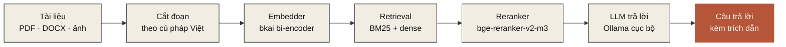

khôi phục dấusửa chính tảocr tiếng việtrag cục bộtách từchunking văn bảnembedder bkaireranker bge-m3tesseract vieollamafastapi + reactapache 2.0khôi phục dấusửa chính tảocr tiếng việtrag cục bộtách từchunking văn bảnembedder bkaireranker bge-m3tesseract vieollamafastapi + reactapache 2.0

<h2>§ 02 · Bốn lựa chọn nên có ngay</h2>

Mỗi gợi ý đều có script đo trong <code>benchmarks/</code> — chạy được từ một bản clone sạch, không có số phỏng đoán.

01 · mặc định

<h3>vn-diacritic-vit5-base</h3>

Khôi phục dấu trên 4 register, trung bình <strong>97.4 %</strong>. Cân bằng giữa hành chính / kinh doanh / hội thoại / văn học. 220M tham số, giấy phép Apache 2.0.

<a href="/tasks/diacritic-restoration" class="ev-corner-link">tài liệu</a>

02 · sửa lỗi

<h3>vn-spell-correction-base</h3>

Một lượt cho cả lỗi gõ Telex, lỗi OCR, viết tắt teen-code và mất dấu. <strong>98.58 % light · 97.35 % heavy</strong> trên 8-split eval grid.

<a href="/tasks/spell-correction" class="ev-corner-link">tài liệu</a>

03 · rag cục bộ

<h3>bkai bi-encoder + bge-reranker</h3>

Embedder Apache 2.0 fine-tune trên Zalo Legal: <strong>R@1 76.25 %</strong>. Ghép cùng Reranker <code>BAAI/bge-reranker-v2-m3</code> cho điểm cuối <strong>R@1 86.3 %</strong>.

<a href="/architecture" class="ev-corner-link">kiến trúc</a>

04 · cài đặt

<h3>pip install nom-vn[chat]</h3>

Một lệnh là có sẵn FastAPI + React UI, parser PDF/DOCX/XLSX/PPTX, Embedder, Retrieval và Reranker. <code>nom serve</code> mở <code>localhost:8080</code>.

<a href="/vi/quickstart" class="ev-corner-link">cài đặt</a>

<h2>§ 03 · Pipeline RAG</h2>

Sáu bước, mỗi bước là một module thay thế được qua <code>Protocol</code> — không khoá vào nhà cung cấp nào.

<h2>§ 04 · Triết lý vận hành</h2>

Bốn nguyên tắc bất di bất dịch — đã thấm vào mọi commit và mọi con số trên trang này.

P · 01

Đo trước, công bố sau

Mọi con số xuất hiện trong tài liệu hay model card đều có script <code>benchmarks/…</code> chạy được từ một bản clone sạch và file kết quả JSON commit trong repo. Khi chưa đo, chúng tôi để trống thay vì viết "TBD" — minh bạch là điều kiện tiên quyết.

P · 02

Riêng tư mặc định

Không gọi cloud API thuê bao mặc định; mọi mô hình chạy cục bộ qua Ollama hoặc trên CPU/GPU của bạn. Dữ liệu nhạy cảm — hợp đồng, hồ sơ y tế, tài liệu nội bộ — không rời máy người dùng.

P · 03

Bảo mật supply chain

Loại bỏ phụ thuộc kèm file pickle (<code>.pkl</code>); ưu tiên <code>safetensors</code>. Mỗi mô hình bên thứ ba có SHA256 được audit, được pin theo revision, và được giải thích lý do trong docstring của wrapper.

P · 04

Đa register

Mọi mô hình được đo trên ít nhất hai register khác nhau (kinh doanh + văn học, hoặc in-domain + out-of-domain). Khoảng cách >10 pp giữa các register là dấu hiệu over-fit và sẽ được ghi rõ trong model card thay vì bị che giấu.

## Cộng đồng

* **Hỏi đáp / báo lỗi:** [GitHub Issues](https://github.com/nrl-ai/nom-vn/issues)
* **Pull request:** xem [CONTRIBUTING](https://github.com/nrl-ai/nom-vn/blob/main/CONTRIBUTING.md)
* **Mô hình + dữ liệu:** [huggingface.co/nrl-ai](https://huggingface.co/nrl-ai)
* **Liên hệ tác giả chính:** [vietanh@nrl.ai](mailto:vietanh@nrl.ai) · Neural Research Lab

