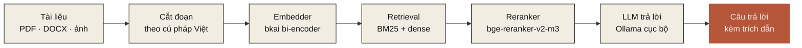

<h2>§ 02 · Dùng được vào việc gì</h2>

Mười hai tác vụ đã ship — mỗi tác vụ có trang riêng kèm số đo trên dữ liệu thật và lệnh tái lập từ một bản clone sạch.

<a class="ev-usecase" href="/tasks/rag">

01 · RAG

<h3>Hỏi đáp trên kho tài liệu</h3>

Tải PDF / DOCX / XLSX / PPTX / ảnh — Nôm cắt đoạn, sinh vector, tra cứu, xếp hạng lại, trả lời kèm trích dẫn. <strong>R@1 86,3 %</strong> trên Zalo Legal.

Xem tài liệu RAG →
</a>

<a class="ev-usecase" href="/tasks/translate">

02 · dịch thuật

<h3>Dịch Việt ↔ Anh giữ nguyên định dạng</h3>

Dịch <code>.docx</code> / <code>.xlsx</code> / <code>.pptx</code> / <code>.txt</code> — giữ nguyên tiêu đề, bảng, cấu trúc. Chạy nội bộ qua Ollama hoặc gọi Claude / GPT cho tác vụ không nhạy cảm.

Xem dịch thuật →
</a>

<a class="ev-usecase" href="/tasks/convert">

03 · chuyển định dạng

<h3>PDF / ảnh → DOCX chỉnh sửa được</h3>

OCR (Tesseract <code>vie</code> cho dòng in, Vintern cho viết tay), bóc bố cục, dựng lại DOCX với đoạn văn, bảng, đầu trang chân trang. Đầu vào để dịch, biên tập, hoặc lưu trữ.

Xem chuyển định dạng →
</a>

<a class="ev-usecase" href="/tasks/spell-correction">

04 · sửa văn bản

<h3>Khôi phục dấu + sửa chính tả</h3>

Một mô hình ViT5 220 M xử lý gọn lỗi gõ Telex, mất dấu, lỗi OCR trong một lượt. <strong>98,32 %</strong> tổng hợp light · <strong>79,62 %</strong> OOD ngoài phân phối — vượt Toshiiiii1.

Xem sửa chính tả →
</a>

<a class="ev-usecase" href="/tasks/ocr">

05 · OCR (chữ in)

<h3>Đọc ảnh / PDF scan tiếng Việt</h3>

Tesseract <code>vie</code> cho dòng in (<strong>CER 0,00 %</strong> sạch · 0,70 % nhiễu nhẹ), VietOCR cho chữ viết tay (<strong>CER 31,82 %</strong>) — vượt Tesseract 37,5 pp ở dòng viết tay.

Xem OCR →
</a>

<a class="ev-usecase" href="/tasks/handwriting">

06 · OCR chữ viết tay

<h3>Đọc biểu mẫu / ghi chú / CMND viết tay</h3>

Vintern-1B-v3_5 (MIT, safetensors) qua VLM cấp trang. <strong>CER 0,47 % sạch / 0,37 % nhiễu</strong> trên 20 ảnh chữ in tổng hợp; cảnh báo: VLM ảo trên line crop hẹp, phải truyền cả trang.

Xem OCR chữ viết tay →
</a>

<a class="ev-usecase" href="/tasks/stt">

07 · giọng nói → văn bản

<h3>Chuyển ghi âm tiếng Việt thành văn bản</h3>

PhoWhisper-large (BSD-3, VinAI fine-tune Whisper trên 844 giờ VN) hoặc Whisper-large-v3 (đa ngôn ngữ, audio lai EN/VN). Đo nội bộ n=3: <strong>WER 15,2 %</strong>; cần đo trên ViMD 3 vùng.

Xem STT →
</a>

<a class="ev-usecase" href="/tasks/summarize">

08 · tóm tắt

<h3>Tóm tắt báo / hợp đồng / hội thoại</h3>

VietAI ViT5-large-vietnews (MIT, 866 M) với prefix theo văn phong. Upstream ROUGE-1 63,4 vietnews. <strong>Cảnh báo:</strong> mô hình có thể bịa số liệu cụ thể — đừng dùng cho pháp lý / tài chính nếu không kiểm chứng số.

Xem tóm tắt →
</a>

<a class="ev-usecase" href="/tasks/register">

09 · phân loại văn phong

<h3>Định tuyến văn bản theo thể loại</h3>

Quy tắc heuristic 4 lớp (trang trọng / kinh doanh / hội thoại / văn học) — chạy ~1 ms cục bộ, không cần model. Đường PhoBERT fine-tune (mục tiêu macro-F1 ≥ 0,85) đã có script, đang chờ chạy.

Xem phân loại văn phong →
</a>

<a class="ev-usecase" href="/tasks/agents">

10 · tác tử

<h3>Tác tử AI gọi công cụ và MCP</h3>

6 mẫu Anthropic (Single / Chain / Route / Parallel / Voting / Orchestrator-Evaluator) + cầu nối MCP để mở hoặc dùng công cụ ngoài. Streaming bằng SSE, có audit log.

Xem tác tử →
</a>

<a class="ev-usecase" href="/tasks/ner">

11 · trích xuất thực thể

<h3>NER chuẩn + bộ pháp lý VN</h3>

Trích PER / ORG / LOC / DATE / MONEY (chuẩn) và <strong>LAW_REF</strong> (luật, điều, khoản) / <strong>ID_VN</strong> (CMND/CCCD) / <strong>PHONE_VN</strong> (bộ pháp lý) cho hợp đồng VN. Quy tắc, không cần GPU.

Xem trích xuất thực thể →
</a>

<a class="ev-usecase" href="/tasks/compliance">

12 · tuân thủ

<h3>Phân loại rủi ro AI · Luật 134/2025</h3>

Phân loại theo 3 mức (cao / trung / thấp) đối chiếu Điều 8–15. Mỗi quyết định kèm điều luật áp dụng và lý do — đầu vào dạng tự nhiên, không cần nhãn thủ công.

Xem tuân thủ →
</a>

<h2>§ 03 · Sản phẩm thấy được</h2>

Một lệnh <code>nom serve</code> là có giao diện web đầy đủ chạy ngay trên máy của bạn — không phải chỉ một thư viện trong terminal.

<figure class="ev-shot ev-shot-wide">

<figcaption><strong>Hỏi đáp trên không gian "Hợp đồng &amp; Báo cáo".</strong> Câu trả lời kèm trích dẫn được liên kết về tài liệu nguồn — bạn click vào để xem đoạn gốc.</figcaption>
</figure>

<figure class="ev-shot">

<figcaption><strong>Bóc tách DOCX / XLSX / PPTX.</strong> Giữ nguyên đầu trang, bảng và cấu trúc. Xem được cả văn bản gốc và phần đã trích.</figcaption>
</figure>

<figure class="ev-shot">

<figcaption><strong>Khôi phục dấu trực tiếp.</strong> Dán văn bản không dấu, chọn register (kinh doanh, hội thoại, văn học...), chọn backend (rule / mô hình HF / LLM) — chạy thẳng trên máy.</figcaption>
</figure>

<figure class="ev-shot">

<figcaption><strong>Dịch thuật giữ nguyên định dạng.</strong> Việt ↔ Anh cho <code>.docx</code> / <code>.xlsx</code> / <code>.pptx</code> / <code>.txt</code> — giữ nguyên tiêu đề, bảng, cấu trúc. Chuyển đổi PDF / ảnh sang DOCX qua OCR rồi dịch tiếp.</figcaption>
</figure>

<figure class="ev-shot">

<figcaption><strong>API và ví dụ tích hợp.</strong> Mọi tác vụ có sẵn endpoint REST. Dán cURL hoặc dùng thư viện Python để ghép vào hệ thống của bạn.</figcaption>
</figure>

<a href="/tasks/translate">Xem dịch thuật</a> · <a href="/tasks/convert">Xem chuyển định dạng</a> · <a href="/vi/quickstart">Cài và mở thử trong 2 phút →</a>

<h2>§ 04 · Pipeline RAG</h2>

Sáu bước, mỗi bước là một module thay thế được qua <code>Protocol</code> — không khoá vào nhà cung cấp nào.

<h2>§ 05 · Triết lý vận hành</h2>

Bốn nguyên tắc bất di bất dịch — đã thấm vào mọi commit và mọi con số trên trang này.

P · 01

Đo trước, công bố sau

Mọi con số xuất hiện trong tài liệu hay model card đều có script <code>benchmarks/…</code> chạy được từ một bản clone sạch và file kết quả JSON commit trong repo. Khi chưa đo, chúng tôi để trống thay vì viết "TBD" — minh bạch là điều kiện tiên quyết.

P · 02

Riêng tư mặc định

Không gọi đám mây thuê bao mặc định; mọi mô hình chạy nội bộ qua Ollama hoặc trên CPU/GPU của bạn. Dữ liệu nhạy cảm — hợp đồng, hồ sơ y tế, tài liệu nội bộ — không rời máy người dùng.

P · 03

Bảo mật nguồn gốc phần mềm

Loại bỏ phụ thuộc kèm tệp pickle (<code>.pkl</code>); ưu tiên <code>safetensors</code>. Mỗi mô hình bên thứ ba có bản băm SHA256 được audit, được pin theo phiên bản, và được giải thích lý do trong tài liệu của lớp bao bọc.

P · 04

Đa register

Mọi mô hình được đo trên ít nhất hai register khác nhau (kinh doanh + văn học, hoặc trong-miền + ngoài-miền). Khoảng cách >10 pp giữa các register là dấu hiệu over-fit và sẽ được ghi rõ trong model card thay vì bị che giấu.

<h2>§ 06 · Đi đâu tiếp</h2>

Tuỳ bạn đang ở vai gì — học hỏi, tự cài, hay đánh giá cho doanh nghiệp.

<a class="ev-next" href="/vi/quickstart">

cho lập trình viên

<h3>Cài và chạy trong 2 phút</h3>

Một lệnh <code>pip install nom-vn[chat]</code>, một lệnh <code>nom serve</code>. Mở <code>localhost:8080</code> và bắt đầu hỏi.

Cài đặt nhanh →
</a>

<a class="ev-next" href="/tasks/">

cho nhà nghiên cứu

<h3>Số đo trên 4 register</h3>

Mỗi tác vụ — khôi phục dấu, sửa chính tả, OCR, tách từ, embedding, reranker, RAG — có trang riêng kèm số đo và lệnh tái lập.

Xem các tác vụ →
</a>

<a class="ev-next" href="/doanh-nghiep/">

cho doanh nghiệp

<h3>Triển khai nội bộ + hợp đồng cam kết</h3>

Tự cài / vùng riêng đám mây / mạng cô lập. Tuân thủ Nghị định 13/2023, có hợp đồng SLA, đào tạo trực tiếp.

Phiên bản doanh nghiệp →
</a>

## Cộng đồng

* **Hỏi đáp / báo lỗi:** [GitHub Issues](https://github.com/nrl-ai/nom-vn/issues)
* **Pull request:** xem [CONTRIBUTING](https://github.com/nrl-ai/nom-vn/blob/main/CONTRIBUTING.md)
* **Mô hình + dữ liệu:** [huggingface.co/nrl-ai](https://huggingface.co/nrl-ai)
* **Liên hệ tác giả chính:** [vietanh@nrl.ai](mailto:vietanh@nrl.ai) · Neural Research Lab

