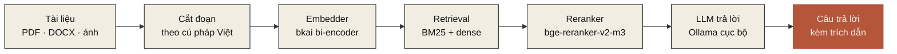

hỏi đáp tài liệukhôi phục dấusửa chính tảocr tiếng việtđọc pdf · word · excel · ppttách từchunkingembedder bkaireranker bge-m3tesseract vieollamafastapi + reactapache 2.0hỏi đáp tài liệukhôi phục dấusửa chính tảocr tiếng việtđọc pdf · word · excel · ppttách từchunkingembedder bkaireranker bge-m3tesseract vieollamafastapi + reactapache 2.0

<h2>§ 02 · Sản phẩm thấy được</h2>

Một lệnh <code>nom serve</code> là có giao diện web đầy đủ chạy ngay trên máy của bạn — không phải chỉ một thư viện trong terminal.

<figure class="ev-shot ev-shot-wide">

<figcaption><strong>Hỏi đáp trên không gian "Hợp đồng &amp; Báo cáo".</strong> Câu trả lời kèm trích dẫn được liên kết về tài liệu nguồn — bạn click vào để xem đoạn gốc.</figcaption>
</figure>

<figure class="ev-shot">

<figcaption><strong>Bóc tách DOCX / XLSX / PPTX.</strong> Giữ nguyên đầu trang, bảng và cấu trúc. Xem được cả văn bản gốc và phần đã trích.</figcaption>
</figure>

<figure class="ev-shot">

<figcaption><strong>Khôi phục dấu trực tiếp.</strong> Dán văn bản không dấu, chọn register (kinh doanh, hội thoại, văn học...), chọn backend (rule / mô hình HF / LLM) — chạy thẳng trên máy.</figcaption>
</figure>

<figure class="ev-shot">

<figcaption><strong>API và ví dụ tích hợp.</strong> Mọi tác vụ có sẵn endpoint REST. Dán cURL hoặc dùng thư viện Python để ghép vào hệ thống của bạn.</figcaption>
</figure>

<a href="/vi/quickstart">Cài và mở thử trong 2 phút →</a>

<h2>§ 03 · Bốn việc bạn có thể làm ngay</h2>

Mỗi khả năng đều có script đo trong <code>benchmarks/</code> — chạy được từ một bản clone sạch, không có số phỏng đoán.

01 · phổ biến nhất

<h3>Hỏi đáp trên kho tài liệu nội bộ</h3>

Hợp đồng, báo cáo, PDF scan, biểu mẫu, công văn — toàn bộ ở lại trong máy của bạn. Pipeline tra cứu đo trên Zalo Legal QA: bkai bi-encoder + bge-reranker → <strong>R@1 86.3 %</strong>. Có UI hỏi đáp và trích dẫn sẵn.

<a href="/tasks/rag" class="ev-corner-link">tài liệu RAG</a>

02 · sửa văn bản

<h3>Khôi phục dấu, sửa chính tả</h3>

Một lượt cho cả lỗi gõ Telex, lỗi OCR, viết tắt teen-code và mất dấu. <code>nrl-ai/vn-spell-correction-base</code> v0.2.29: <strong>98.32 % light · 97.03 % heavy</strong> trên 8 tập kiểm thử; <strong>79.62 %</strong> trên tập ngoài phân phối.

<a href="/tasks/spell-correction" class="ev-corner-link">tài liệu sửa chính tả</a>

03 · giấy thành chữ

<h3>OCR tiếng Việt cho tài liệu scan</h3>

Tesseract <code>vie</code> cho ảnh / PDF scan, kết hợp sửa chính tả sau OCR để đỡ lỗi máy quét. PDF born-digital đi qua pypdfium2 — không OCR thừa, không mất bố cục bảng.

<a href="/tasks/ocr" class="ev-corner-link">tài liệu OCR</a>

04 · tích hợp

<h3>Lập trình ghép vào hệ thống có sẵn</h3>

Thư viện Python type-annotated, Protocol-based — không khoá vào lớp cụ thể. REST API theo OpenAPI 3.1. <code>pip install nom-vn[chat]</code> đầy đủ web app + parser + retrieval + rerank.

<a href="/vi/quickstart" class="ev-corner-link">cài đặt</a>

<h2>§ 04 · Pipeline RAG</h2>

Sáu bước, mỗi bước là một module thay thế được qua <code>Protocol</code> — không khoá vào nhà cung cấp nào.

<h2>§ 05 · Triết lý vận hành</h2>

Bốn nguyên tắc bất di bất dịch — đã thấm vào mọi commit và mọi con số trên trang này.

P · 01

Đo trước, công bố sau

Mọi con số xuất hiện trong tài liệu hay model card đều có script <code>benchmarks/…</code> chạy được từ một bản clone sạch và file kết quả JSON commit trong repo. Khi chưa đo, chúng tôi để trống thay vì viết "TBD" — minh bạch là điều kiện tiên quyết.

P · 02

Riêng tư mặc định

Không gọi đám mây thuê bao mặc định; mọi mô hình chạy nội bộ qua Ollama hoặc trên CPU/GPU của bạn. Dữ liệu nhạy cảm — hợp đồng, hồ sơ y tế, tài liệu nội bộ — không rời máy người dùng.

P · 03

Bảo mật nguồn gốc phần mềm

Loại bỏ phụ thuộc kèm tệp pickle (<code>.pkl</code>); ưu tiên <code>safetensors</code>. Mỗi mô hình bên thứ ba có bản băm SHA256 được audit, được pin theo phiên bản, và được giải thích lý do trong tài liệu của lớp bao bọc.

P · 04

Đa register

Mọi mô hình được đo trên ít nhất hai register khác nhau (kinh doanh + văn học, hoặc trong-miền + ngoài-miền). Khoảng cách >10 pp giữa các register là dấu hiệu over-fit và sẽ được ghi rõ trong model card thay vì bị che giấu.

<h2>§ 06 · Đi đâu tiếp</h2>

Tuỳ bạn đang ở vai gì — học hỏi, tự cài, hay đánh giá cho doanh nghiệp.

<a class="ev-next" href="/vi/quickstart">

cho lập trình viên

<h3>Cài và chạy trong 2 phút</h3>

Một lệnh <code>pip install nom-vn[chat]</code>, một lệnh <code>nom serve</code>. Mở <code>localhost:8080</code> và bắt đầu hỏi.

Cài đặt nhanh →
</a>

<a class="ev-next" href="/tasks/">

cho nhà nghiên cứu

<h3>Số đo trên 4 register</h3>

Mỗi tác vụ — khôi phục dấu, sửa chính tả, OCR, tách từ, embedding, reranker, RAG — có trang riêng kèm số đo và lệnh tái lập.

Xem các tác vụ →
</a>

<a class="ev-next" href="/doanh-nghiep/">

cho doanh nghiệp

<h3>Triển khai nội bộ + hợp đồng cam kết</h3>

Tự cài / vùng riêng đám mây / mạng cô lập. Tuân thủ Nghị định 13/2023, có hợp đồng SLA, đào tạo trực tiếp.

Phiên bản doanh nghiệp →
</a>

## Cộng đồng

* **Hỏi đáp / báo lỗi:** [GitHub Issues](https://github.com/nrl-ai/nom-vn/issues)
* **Pull request:** xem [CONTRIBUTING](https://github.com/nrl-ai/nom-vn/blob/main/CONTRIBUTING.md)
* **Mô hình + dữ liệu:** [huggingface.co/nrl-ai](https://huggingface.co/nrl-ai)
* **Liên hệ tác giả chính:** [vietanh@nrl.ai](mailto:vietanh@nrl.ai) · Neural Research Lab

