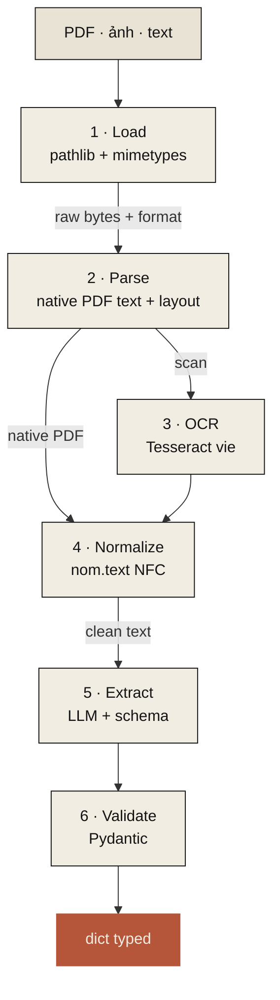

# Nôm v0.1 — pipeline trích xuất tài liệu

Tài liệu này đặc tả luồng dữ liệu đầy đủ cho `nom.doc.extract`. Mỗi
stage có lựa chọn primary, một alternative đã test, và kế hoạch
benchmark. Số liệu hoặc **đo tại đây** hoặc **trích từ phía trên** —
không bao giờ tự nghĩ ra.



Hình dạng: `bytes/Path → Pipeline.run(schema) → dict typed`. Mỗi stage
là một `Stage` protocol; người dùng có thể thay implementation hoặc chèn
thêm stage của riêng mình.

## Stage 1 · Load

**Lựa chọn: stdlib `pathlib` + `mimetypes`.** Không cần dep bên thứ
ba. Detect format từ extension trước, fallback magic-bytes
(`python-magic`, optional).

| Đầu vào | Detect | Định tuyến tới |
|---|---|---|
| `.pdf` | extension + magic `%PDF` | parse → có thể cần OCR per-page |
| `.png` / `.jpg` / `.tiff` | extension + magic | OCR trực tiếp |
| `.txt` / `.md` | extension | normalize → extract (skip 2 & 3) |

## Stage 2 · Parse (text + layout từ PDF native)

**Lựa chọn: PyMuPDF (`fitz`).** Nhanh nhất, hơn 19× trên PDF thực tế.

| Thư viện | Thời gian/doc trung bình | Layout | License | Ghi chú |
|---|---:|---|---|---|
| **PyMuPDF (fitz)** | **0.5s** | bảng, block, font | AGPL hoặc commercial | mặc định — nhanh nhất, giàu nhất |
| pypdf | 4.2s | block cơ bản | MIT | thao tác đơn giản |
| pdfplumber | 9.5s | bảng tốt nhất | MIT | fallback cho dự án không tương thích AGPL |

Nguồn: [py-pdf/benchmarks](https://github.com/py-pdf/benchmarks)

**Hành vi**: trích text per-page; track box layout; flag các page mà
text rỗng (= scan, định tuyến sang OCR).

## Stage 3 · OCR (scan/ảnh sang text)

**Lựa chọn: VietOCR (Transformer)** khi có sẵn, fallback sang
**Tesseract** cho tính portable.

| Engine | Acc công bố trên VN | Tốc độ | Xử lý dấu | License |
|---|---|---|---|---|
| **[VietOCR](https://github.com/pbcquoc/vietocr)** | train trên VN | chậm hơn (Transformer) | mạnh nhất | Apache 2.0 |
| [PaddleOCR PP-OCRv5](https://github.com/PaddlePaddle/PaddleOCR) | 94.5% trên OmniDocBench [1] | trung bình | mạnh (multilingual) | Apache 2.0 |
| [EasyOCR](https://github.com/JaidedAI/EasyOCR) | ~79% chung | 56 FPS [2] | tốt hơn Tesseract | Apache 2.0 |
| [Tesseract 5 + `vie`](https://github.com/tesseract-ocr/tesseract) | 70-97% (phụ thuộc chất lượng ảnh) [3] | 9.8 FPS [2] | yếu — nhầm dấu chồng [4] | Apache 2.0 |

**Hành vi**: OCR per-page cho scan, sau đó post-process bằng
`nom.text.fix_diacritics` để vá lỗi dấu do OCR gây ra.
**Benchmark trong `benchmarks/accuracy/bench_ocr.py` (scaffold hôm
nay, số thực ở v0.1).**

## Stage 4 · Normalize (dọn text)

**Lựa chọn: `nom.text` (chính package này).**

- `normalize` — Unicode NFC (tất định, 9M ops/s)
- `fix_diacritics` — khôi phục dấu mất khi OCR
  - v0.0.1 (hiện tại): rule-based, baseline đo được 41%
  - v0.0.2: ML-backed qua PyVi hoặc DistilBERT-Viet, target ~90%+
  - v0.1: LLM-backed khi truyền `llm=`
- `tokenize` (dự kiến v0.0.2): dùng **Underthesea** (acc tách từ 80% [5]) thay PyVi (57.8%)

## Stage 5 · Extract (LLM + schema)

**Lựa chọn: [Instructor](https://github.com/567-labs/instructor)** wrap quanh LLM của người dùng.

| Thư viện | Cách tiếp cận | Star | Lợi | Bất lợi |
|---|---|---:|---|---|
| **Instructor** | Function calling + Pydantic | **11k** | 15+ provider (OpenAI/Claude/Ollama/...), 3M dl/tháng, type-safe, retry | yêu cầu mô hình hỗ trợ function-calling |
| [LangExtract](https://github.com/google/langextract) | Few-shot + controlled generation | đang lớn | trích có nguồn, traceability vị trí chính xác | mới hơn, tune cho Gemini |
| [Outlines](https://github.com/dottxt-ai/outlines) | Constrained token sampling | mạnh | chạy với mọi mô hình HF/vLLM, đảm bảo schema cứng | yêu cầu kiểm soát nội bộ mô hình |

**Vì sao Instructor**: trưởng thành nhất, hỗ trợ provider rộng nhất,
Pydantic-native (khớp khai báo schema của chúng tôi), chạy với các
lựa chọn LLM tier của chúng tôi.

### Định tuyến LLM theo tier

| Tier | Khuyến nghị | Lý do |
|---|---|---|
| **Local mặc định** | [Qwen3-8B qua Ollama](https://ollama.com/library/qwen3) | Apache 2.0, chạy 6GB VRAM (Q4) hoặc 16GB CPU |
| **Cloud open** | [Qwen3-235B-A22B](https://www.alibabacloud.com/) qua Together / Fireworks | Top hiệu năng VN open, ~$0.50–1/M input token |
| **Cloud closed** | gpt-4o / claude-sonnet | Tốt nhất VN chung, tham chiếu cho benchmark |
| **Vision (skip OCR)** | [Qwen2.5-VL-72B-Instruct](https://huggingface.co/Qwen/Qwen2.5-VL-72B-Instruct) | Best open vision-LLM cho extraction tài liệu có cấu trúc [6] |

Nguồn xếp hạng mô hình VN: [VMLU leaderboard](https://vmlu.ai/leaderboard) + [SiliconFlow 2026 review](https://www.siliconflow.com/articles/en/best-open-source-LLM-for-Vietnamese).

## Stage 6 · Validate

**Lựa chọn: Pydantic v2.** Đã là dep transitive qua Instructor.

Schema do user khai báo *chính là* model Pydantic. Validation chạy ở
thời điểm nhận kết quả extract. Coercion:

- `"date"` → `datetime.date`
- `"amount_vnd"` → `int` (parse được cả `1.500.000.000` và `một tỷ năm trăm triệu`)
- `"party"` → model `Party` lồng nhau với `name`, `tax_id`, `address`, `representative`

Type shorthand built-in nằm ở `nom.doc.schemas`.

## End-to-end: phiên user v0.1 (dự kiến)

```python
from nom.doc import extract
from nom.llm import Ollama

result = extract(
    "hop_dong.pdf",
    schema={
        "so_hop_dong": str,
        "ngay_ky": "date",
        "ben_a": "party",
        "ben_b": "party",
        "tong_gia_tri": "amount_vnd",
    },
    llm=Ollama(model="qwen3:8b"),
)
# {
#   'so_hop_dong': 'HĐ-2025-002',
#   'ngay_ky': date(2025, 3, 14),
#   'ben_a': Party(name='Công ty Cổ phần Hồng Hà', tax_id='0123456789', ...),
#   'ben_b': Party(name='Bà Nguyễn Thị Hương', ...),
#   'tong_gia_tri': 1_500_000_000,
# }
```

## Benchmark theo từng stage

| Stage | File benchmark | Đo cái gì | Trạng thái |
|---|---|---|---|
| 1. Load | — | tầm thường | n/a |
| 2. Parse | `benchmarks/perf/bench_pdf.py` (dự kiến) | throughput parse PDF, char accuracy | v0.1 |
| 3. OCR | `benchmarks/accuracy/bench_ocr.py` (scaffold hôm nay) | char/word accuracy + tốc độ qua các engine | v0.1 |
| 4. Normalize | `benchmarks/accuracy/bench_diacritics.py` ✅ | khôi phục dấu mức từ | v0.0.1 |
| 4. Normalize (perf) | `benchmarks/perf/bench_text.py` ✅ | throughput per-function | v0.0.1 |
| 5. Extract | `benchmarks/models/bench_extraction.py` (scaffold) | extraction accuracy qua các LLM | v0.1 |
| End-to-end | `benchmarks/accuracy/bench_pipeline.py` (scaffold hôm nay) | accuracy hỗn hợp trên hợp đồng thực | v0.1 |

## Nguồn

- [1] [Phát hành PaddleOCR PP-OCRv5](https://www.tenorshare.com/ocr/paddleocr.html)
- [2] [Benchmark PaddleOCR vs EasyOCR vs Tesseract](https://tildalice.io/ocr-tesseract-easyocr-paddleocr-benchmark/)
- [3] [Trang benchmark VietOCR](https://vietocr.sourceforge.net/)
- [4] [Issue stack-diacritic Tesseract VN](https://github.com/tesseract-ocr/langdata/issues/66)
- [5] [Benchmark tokenizer tiếng Việt](https://huybik.github.io/Word-Tokenizer-Benchmark/)
- [6] [Best LLM cho Document Screening 2026 — SiliconFlow](https://www.siliconflow.com/articles/en/best-open-source-LLM-for-Document-screening)
- [7] [VMLU Leaderboard](https://vmlu.ai/leaderboard)
- [8] [Survey on Vietnamese Document Analysis (arXiv 2506.05061)](https://arxiv.org/abs/2506.05061)
- [9] [VN-MTEB: Vietnamese Massive Text Embedding Benchmark](https://arxiv.org/html/2507.21500v1)

## Cố ý không nằm trong v0.1

- **Module embedding tuỳ biến** — RAG là mối quan tâm riêng. Khi thêm `nom.embeddings`, lựa chọn (đã verify với [VN-MTEB](https://arxiv.org/html/2507.21500v1)) sẽ là: AITeamVN/Vietnamese_Embedding (BGE-M3 base) cho retrieval, dangvantuan/vietnamese-document-embedding (8192 ctx) cho doc dài. Quyết định ở v0.3+.
- **Đường vision-only (Donut/LayoutLM)** — hứa hẹn nhưng chưa train VN. Theo dõi tài liệu; tích hợp khi có một mô hình đáng khuyến nghị.
- **Extraction layout-aware** — PyMuPDF cho ta block; reasoning layout đầy đủ chờ v0.2+.
- **Phân loại tài liệu** — ngoài phạm vi. Dùng Pydantic discriminated union nếu cần.
