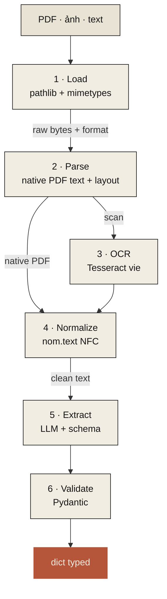

# Nôm v0.1 — the document-extraction pipeline

::: tip Tài liệu kỹ thuật
Trang này còn ở bản tiếng Anh — bản gốc dùng cho contributor quốc tế trên GitHub.
Đang được dịch dần sang tiếng Việt. Mọi con số trong trang là chính thức,
có script đo cam kết trong repo.
:::

This document specifies the full data flow for `nom.doc.extract`. Every stage has a chosen primary, a tested alternative, and a benchmark plan. Numbers are either **measured here** or **cited from upstream** — never invented.



The shape: `bytes/Path → Pipeline.run(schema) → typed dict`. Every stage is a `Stage` protocol; users can swap implementations or insert their own.

## Stage 1 · Load

**Pick: stdlib `pathlib` + `mimetypes`.** No third-party dep needed. Detect format from extension first, magic-bytes fallback (`python-magic`, optional).

| Input | Detection | Routes to |
|---|---|---|
| `.pdf` | extension + `%PDF` magic | parse → may need OCR per page |
| `.png` / `.jpg` / `.tiff` | extension + magic | OCR direct |
| `.txt` / `.md` | extension | normalize → extract (skip 2 & 3) |

## Stage 2 · Parse (native PDF text + layout)

**Pick: PyMuPDF (`fitz`).** Fastest by 19× on real PDFs.

| Library | Avg time/doc | Layout | License | Notes |
|---|---:|---|---|---|
| **PyMuPDF (fitz)** | **0.5s** | tables, blocks, fonts | AGPL or commercial | default — fastest, richest |
| pypdf | 4.2s | basic blocks | MIT | simple ops |
| pdfplumber | 9.5s | best tables | MIT | fallback for AGPL-incompatible projects |

Source: [py-pdf/benchmarks](https://github.com/py-pdf/benchmarks)

**Behavior**: extract text per page; track layout boxes; flag pages where text is empty (= scan, route to OCR).

## Stage 3 · OCR (scan/image to text)

**Pick: VietOCR (Transformer)** when available, fall back to **Tesseract** for portability.

| Engine | Reported acc on VN | Speed | Diacritic handling | License |
|---|---|---|---|---|
| **[VietOCR](https://github.com/pbcquoc/vietocr)** | trained on VN | slower (Transformer) | strongest | Apache 2.0 |
| [PaddleOCR PP-OCRv5](https://github.com/PaddlePaddle/PaddleOCR) | 94.5% on OmniDocBench [1] | medium | strong (multilingual) | Apache 2.0 |
| [EasyOCR](https://github.com/JaidedAI/EasyOCR) | ~79% general | 56 FPS [2] | better than Tesseract | Apache 2.0 |
| [Tesseract 5 + `vie`](https://github.com/tesseract-ocr/tesseract) | 70-97% (image quality dependent) [3] | 9.8 FPS [2] | weak — confuses stacked tones [4] | Apache 2.0 |

**Behavior**: per-page OCR for scans, then post-process with `nom.text.fix_diacritics` to repair OCR-induced tone-mark errors. **Benchmark in `benchmarks/accuracy/bench_ocr.py` (scaffold today, real numbers in v0.1).**

## Stage 4 · Normalize (text cleanup)

**Pick: `nom.text` (this package).**

- `normalize` — Unicode NFC (deterministic, 9M ops/s)
- `fix_diacritics` — restore tone marks lost in OCR
  - v0.0.1 (now): rule-based, 41% measured baseline
  - v0.0.2: ML-backed via PyVi or DistilBERT-Viet, ~90%+ target
  - v0.1: LLM-backed when `llm=` is provided
- `tokenize` (planned v0.0.2): use **Underthesea** (80% segmentation accuracy [5]) over PyVi (57.8%)

## Stage 5 · Extract (LLM + schema)

**Pick: [Instructor](https://github.com/567-labs/instructor)** wrapping the user's LLM.

| Library | Approach | Stars | Pros | Cons |
|---|---|---:|---|---|
| **Instructor** | Function calling + Pydantic | **11k** | 15+ providers (OpenAI/Claude/Ollama/...), 3M dl/month, type-safe, retries | requires function-calling-capable model |
| [LangExtract](https://github.com/google/langextract) | Few-shot + controlled generation | growing | source-grounded extraction, exact-position traceability | newer, Gemini-tuned |
| [Outlines](https://github.com/dottxt-ai/outlines) | Constrained token sampling | strong | works with any HF/vLLM model, hard schema guarantees | requires model-internal control |

**Why Instructor**: highest maturity, broadest provider support, Pydantic-native (matches our schema declaration), works with our LLM tier choices.

### LLM tier routing

| Tier | Recommended | Why |
|---|---|---|
| **Local default** | [Qwen3-8B via Ollama](https://ollama.com/library/qwen3) | Apache 2.0, runs in 6GB VRAM (Q4) or 16GB CPU |
| **Cloud open** | [Qwen3-235B-A22B](https://www.alibabacloud.com/) via Together / Fireworks | Top open VN performance, ~$0.50–1/M input tokens |
| **Cloud closed** | gpt-4o / claude-sonnet | Best general VN, reference for benchmarks |
| **Vision (skip OCR)** | [Qwen2.5-VL-72B-Instruct](https://huggingface.co/Qwen/Qwen2.5-VL-72B-Instruct) | Best open vision-LLM for structured doc extraction [6] |

Source for VN model rankings: [VMLU leaderboard](https://vmlu.ai/leaderboard) + [SiliconFlow 2026 review](https://www.siliconflow.com/articles/en/best-open-source-LLM-for-Vietnamese).

## Stage 6 · Validate

**Pick: Pydantic v2.** Already a transitive dep through Instructor.

The schema declared by the user *is* the Pydantic model. Validation happens at extraction-result-receipt time. Coercions:

- `"date"` → `datetime.date`
- `"amount_vnd"` → `int` (parses `1.500.000.000` and `một tỷ năm trăm triệu` formats)
- `"party"` → nested `Party` model with `name`, `tax_id`, `address`, `representative`

Built-in shorthand types live in `nom.doc.schemas`.

## End-to-end: a v0.1 user session (planned)

```python
from nom.doc import extract
from nom.llm import Ollama

result = extract(
    "hop_dong.pdf",
    schema={
        "so_hop_dong": str,
        "ngay_ky": "date",
        "ben_a": "party",
        "ben_b": "party",
        "tong_gia_tri": "amount_vnd",
    },
    llm=Ollama(model="qwen3:8b"),
)
# {
#   'so_hop_dong': 'HĐ-2025-002',
#   'ngay_ky': date(2025, 3, 14),
#   'ben_a': Party(name='Công ty Cổ phần Hồng Hà', tax_id='0123456789', ...),
#   'ben_b': Party(name='Bà Nguyễn Thị Hương', ...),
#   'tong_gia_tri': 1_500_000_000,
# }
```

## Benchmarks per stage

| Stage | Benchmark file | What it measures | Status |
|---|---|---|---|
| 1. Load | — | trivial | n/a |
| 2. Parse | `benchmarks/perf/bench_pdf.py` (planned) | PDF parse throughput, char accuracy | v0.1 |
| 3. OCR | `benchmarks/accuracy/bench_ocr.py` (scaffold today) | char/word accuracy + speed across engines | v0.1 |
| 4. Normalize | `benchmarks/accuracy/bench_diacritics.py` ✅ | word-level diacritic recovery | v0.0.1 |
| 4. Normalize (perf) | `benchmarks/perf/bench_text.py` ✅ | throughput per function | v0.0.1 |
| 5. Extract | `benchmarks/models/bench_extraction.py` (scaffold) | extraction accuracy across LLMs | v0.1 |
| End-to-end | `benchmarks/accuracy/bench_pipeline.py` (scaffold today) | composite accuracy on real contracts | v0.1 |

## Sources

- [1] [PaddleOCR PP-OCRv5 release](https://www.tenorshare.com/ocr/paddleocr.html)
- [2] [PaddleOCR vs EasyOCR vs Tesseract benchmark](https://tildalice.io/ocr-tesseract-easyocr-paddleocr-benchmark/)
- [3] [VietOCR benchmark page](https://vietocr.sourceforge.net/)
- [4] [Tesseract VN stack-diacritic issue](https://github.com/tesseract-ocr/langdata/issues/66)
- [5] [Vietnamese tokenizer benchmark](https://huybik.github.io/Word-Tokenizer-Benchmark/)
- [6] [Best LLM for Document Screening 2026 — SiliconFlow](https://www.siliconflow.com/articles/en/best-open-source-LLM-for-Document-screening)
- [7] [VMLU Leaderboard](https://vmlu.ai/leaderboard)
- [8] [Survey on Vietnamese Document Analysis (arXiv 2506.05061)](https://arxiv.org/abs/2506.05061)
- [9] [VN-MTEB: Vietnamese Massive Text Embedding Benchmark](https://arxiv.org/html/2507.21500v1)

## What's deliberately not in v0.1

- **Custom embeddings module** — RAG is a separate concern. When we add `nom.embeddings`, the picks (verified against [VN-MTEB](https://arxiv.org/html/2507.21500v1)) will be: AITeamVN/Vietnamese_Embedding (BGE-M3 base) for retrieval, dangvantuan/vietnamese-document-embedding (8192 ctx) for long-doc. Decided in v0.3+.
- **Vision-only path (Donut/LayoutLM)** — promising but VN-untrained. Track the literature; integrate when there's a model worth recommending.
- **Layout-aware extraction** — PyMuPDF gives us blocks; full layout reasoning waits for v0.2+.
- **Document classification** — out of scope. Use Pydantic discriminated unions if you need it.
