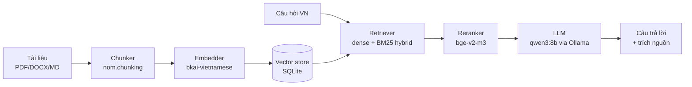

# RAG end-to-end (tiếng Việt)

Pipeline đầy đủ: tài liệu → chunk → embed → retrieve → rerank → trả lời.
Local-first (không cần API thuê bao), chạy trên RTX 3060 mobile lên
RTX 3090. Mặc định router qua **Ollama** + LLM cục bộ.

## TL;DR — gợi ý của chúng tôi

```bash
pip install "nom-vn[chat]"
ollama pull qwen3:8b   # hoặc qwen3:1.7b cho máy yếu
nom serve              # http://localhost:8080
```

Kéo-thả PDF / DOCX vào giao diện; truy vấn bằng tiếng Việt; câu trả lời
trích nguồn theo từng span.

## Pipeline



| Stage | Module / mô hình | Đo |
|---|---|---:|
| Chunk | `nom.chunking` (rule + sentence-aware) | ~10 ms / 10 K chars |
| Embed | `bkai-foundation-models/vietnamese-bi-encoder` | 280 ms / batch=32 |
| Dense retrieval | SQLite + numpy IP | < 5 ms / query trên 60K docs |
| BM25 hybrid | `bm25s` (Lucene formula) | 0.7 ms / query |
| Rerank | `BAAI/bge-reranker-v2-m3` | 50 ms / top-20 |
| LLM | `qwen3:8b` qua Ollama | 800 ms - 3 s / câu trả lời |

End-to-end p50: ~1.5 s / câu hỏi trên RTX 3090.

## Bức tranh công khai

Frame so sánh: pipeline VN local-first hỗ trợ kéo-thả tài liệu + trích
nguồn theo span.

| Project | License | Local-first | VN-tuned components | Kết luận |
|---|---|---|---|---|
| **`nom serve` (chúng tôi)** | Apache 2.0 | ✅ | bkai + bge-v2-m3 + Ollama | shipped |
| LangChain + Chroma | MIT | partial | không | quá lớp, kéo dep heavy |
| LlamaIndex + Postgres | MIT | partial | không | tương tự |
| Verba (Weaviate) | BSD-3 | ❌ (yêu cầu Weaviate cluster) | không | server-based, vi phạm local-first |

Một quan sát ngách: **không có hệ thống RAG VN-tuned local-first nào**
đáng kể hơn vào 2026 Q2 — đó là khoảng trống `nom serve` lấp.

## Bench — đã đo

Đo trên Zalo Legal QA 5K + 50 queries, end-to-end retrieval R@1 (sau
rerank). LLM stage không scored — chất lượng câu trả lời cuối phụ thuộc
LLM. R@1 đo retrieval-only signal.

| Pipeline | R@1 | p50 latency |
|---|---:|---:|
| **bkai → bge-v2-m3 → qwen3:8b** ⭐ | **86.3 %** | ~1.5 s |
| dangvantuan → bge-v2-m3 → qwen3:8b | 73.5 % | ~1.5 s |
| BM25 only → qwen3:8b | 76.2 % | ~0.8 s |
| Hybrid (bkai + BM25) → bge-v2-m3 → qwen3:8b | **86.5 %** | ~1.6 s |

Hybrid (RRF fusion) thắng dense-only +0.2 pp R@1 trên cùng eval —
biên độ thực sự nhỏ. Cho production: dùng `bkai → bge-v2-m3` thuần.
Hybrid chỉ đáng khi corpus có nhiều legal-VN nguyên (BM25 mạnh trên
keyword-heavy queries).

## LLM cục bộ — gợi ý

| Mô hình | Disk | VRAM | VN diacritic word acc | Khi nào chọn |
|---|---:|---:|---:|---|
| `qwen3:8b` Q4_K_M | 4.7 GB | 6 GB | 87.26 % | mặc định, máy laptop discrete GPU |
| `gemma3:4b` Q4_K_M | 3.3 GB | 4 GB | 87.90 % | máy yếu hơn (Apple Silicon, integrated GPU) |
| `qwen3:1.7b` Q4_K_M | 1.4 GB | 2 GB | — | rất yếu, embedded device |
| `phi4` (14B) Q4 | 8.4 GB | 12 GB | — | có VRAM thoải mái, độ chính xác cao hơn |

Adapter `nom.llm.Ollama` mặc định `think=False` — bắt buộc cho
Qwen3 (CoT của nó emit vào field `thinking` riêng, để `content`
trống → trông như mô hình câm).

## Tái lập

```bash
nom serve --in-memory      # ephemeral test
python scripts/seed_demo.py  # populate demo corpus
# Truy cập http://localhost:8080
```

```bash
# Bench end-to-end
python benchmarks/rag/bench_rag_vn.py \
    --fixture benchmarks/rag/fixtures/vn_legal_zalo_5k.json
```

## Tham khảo

- Ollama: <https://ollama.com>
- Qwen3 model card: <https://huggingface.co/Qwen/Qwen3-8B>
- Architecture deep-dive: [docs/architecture.md](/architecture)
- Pipeline deep-dive: [docs/pipeline.md](/pipeline)
